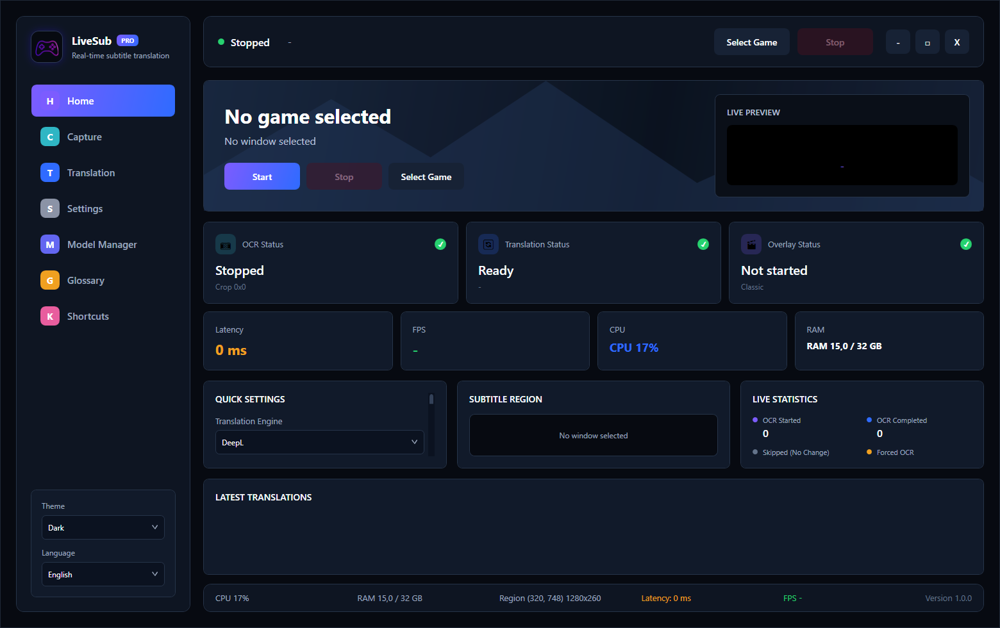
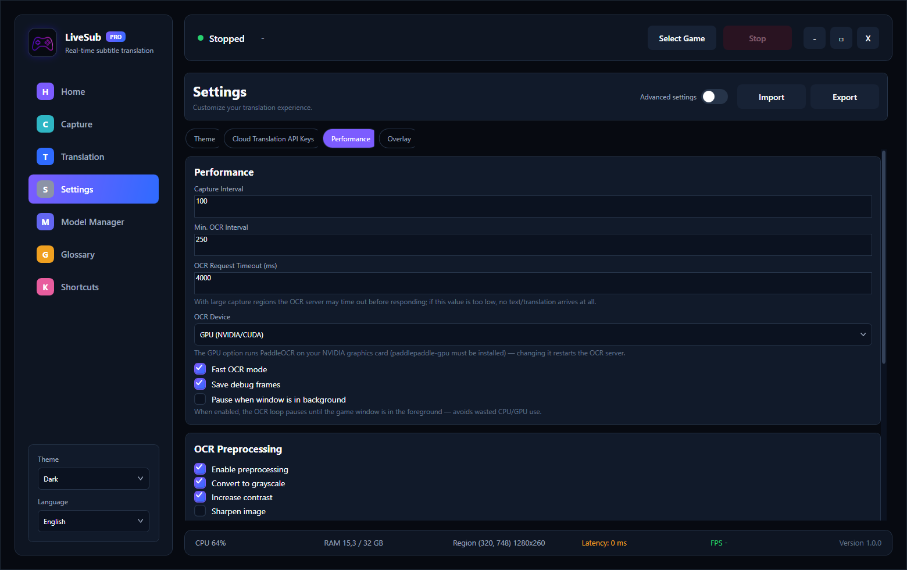
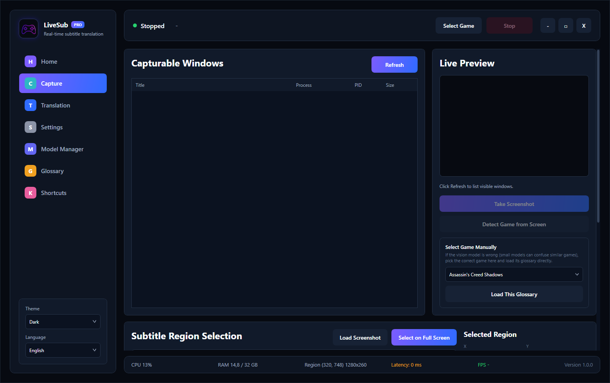

<div align="center">

# 🎮 LiveSub

**Capture game subtitles in real time, read them with OCR, translate them, and render the result as a transparent overlay on top of the game.**

.NET 8 · WPF · MVVM · Windows.Graphics.Capture · PaddleOCR · OPUS-MT

</div>

---

## 📸 Screenshots

> Images live in `docs/screenshots/`.

<div align="center">

### Home — live status, quick settings and pipeline stats


### Settings — pill-tab layout, grouped by category


### Capture & overlay


</div>

---

## ✨ Features

| | |
|---|---|
| 🖥️ **Real-time capture** | Windows.Graphics.Capture with a GDI/PrintWindow fallback — low latency, JPEG pipeline |
| 🔤 **Multiple OCR engines** | PaddleOCR (default), WindowsOCR, RapidOCR, EasyOCR, OneOCR — fast / balanced / hybrid profiles |
| 🌍 **Multiple translation engines** | Local **OPUS-MT** (fine-tunable), DeepL, Google Translate, Gemini, Groq, Ollama, LM Studio |
| ⚡ **Tuned for speed** | PaddleOCR `auto_growth` memory + CTranslate2 (int8_float16) for ~2.5–3× faster translation |
| 🎯 **Game recognition** | Local ONNX classifier (EfficientNet-B0, ~500 IGDB games) + vision LLM — **confidence-gated hybrid** |
| 📖 **Glossaries** | Per-game term dictionaries (Elden Ring, RDR2, Witcher 3, FF, Hogwarts…) load automatically |
| 🪟 **Transparent overlay** | Adjustable font/size/color/opacity, multi-monitor support, nine one-click anchor positions, subtitle-replacement mask |
| 🎨 **Theme & language** | Dark/Light theme, Turkish/English interface |
| 🧪 **Model training** | OPUS-MT fine-tuning plus BLEU/comparison tooling (developer builds only) |

---

## 🎯 Game Recognition — Confidence-Gated Hybrid

When the window title isn't a real game title (PS Remote Play, a YouTube stream, …), the game is identified **from the frame itself**:

```
Screenshot
     │
     ▼
┌─────────────────────┐   confidence >= threshold (0.45)
│  ONNX EfficientNet  │ ───────────────────────────────►  Use this result (fast, offline)
│  (~500 IGDB games)  │
└─────────────────────┘   confidence < threshold
     │                            │
     ▼                            ▼
 low confidence          ┌──────────────────────┐
                         │  Vision LLM (gemma)  │ ──►  Ask the user to confirm
                         └──────────────────────┘
```

The local ONNX model runs first — it's fast and fully offline. If its top-1 softmax confidence clears the threshold the result is used directly; if not (the ambiguous cases where same-engine games get confused), it defers to the vision model. That way the app **never confidently shows a wrong title when the model isn't sure**. Tune the threshold via `TranslationSettings.OnnxGameConfidenceThreshold`.

---

## 📥 Download

Grab the installer from the **[Releases](../../releases)** page and run `LiveSub-Setup.exe`. No .NET installation required — the build is self-contained.

> **Note:** OCR and local translation run on Python sidecar servers (PaddleOCR / OPUS-MT). Fully offline translation needs the Python environment set up (see below). Cloud providers (DeepL/Google/Gemini/Groq) only need your own API key entered in Settings — **keys are stored on your machine only and are never included in the repository or the installer.**

---

## 🧱 Project Layout

| Project | Responsibility |
|---|---|
| `PsGameTranslator.App` | WPF entry point, DI, MVVM shell, all pages |
| `PsGameTranslator.Core` | Shared domain models (no dependencies) |
| `PsGameTranslator.Capture` | Window capture (WGC + GDI fallback) |
| `PsGameTranslator.Ocr` | OCR service contract and providers |
| `PsGameTranslator.Overlay` | Transparent overlay window and settings |
| `PsGameTranslator.Infrastructure` | Translation pipeline, glossary, game recognition, settings, logging |
| `PsGameTranslator.Tests` | Unit tests |

> Assembly and namespace names are still `PsGameTranslator.*` for historical reasons; the shipped product is branded **LiveSub**.

---

## 🔧 Build & Run

**Requirements:** Visual Studio 2022, .NET 8 SDK, .NET Desktop Development workload, Python 3.11

```powershell
dotnet restore
dotnet build PsGameTranslator.sln
```

Set `PsGameTranslator.App` as the startup project and press `F5`.

### Python environment (OCR + local translation)

```powershell
py -3.11 -m venv .venv
.\.venv\Scripts\Activate.ps1
pip install -r tools\ocr\requirements.txt
pip install -r tools\translation\requirements.txt
```

The app starts the OCR server (`tools/ocr/ocr_server.py`, port 8765) and the
translation server (`tools/translation/translation_server.py`, port 8770)
automatically; both can also be run by hand for debugging.

### Developer mode

Developer mode (Ctrl+Shift+D — Learning/Training pages, single-frame/OCR/overlay
test buttons) is compiled into **Debug builds only**. The released installer is a
Release build, so those surfaces are absent for end users.

---

## 🔒 Privacy & API Keys

- API keys (DeepL/Google/Gemini/Groq) are stored at runtime in `config/user_settings.json` **on your machine only**.
- That file is excluded via `.gitignore` — it is **never committed or shipped in the installer**.
- No real API key exists anywhere in the source tree (only empty defaults).

---

## 📚 Documentation

Technical guides (resource optimization, performance theory, architecture
patterns) live in [`docs/`](docs/).

---

## ⚖️ License

**LiveSub is proprietary and closed source. It is not open source.**

Copyright © 2026 Ahmet Yildirim. All rights reserved.

You may download, install and run the official binaries for personal,
non-commercial use. You may **not** use, copy, modify, redistribute or
incorporate the source code, models or assets into any other project. See
[LICENSE](LICENSE) for the full terms.

Third-party components bundled with or required by LiveSub are licensed
separately by their owners and are not covered by that license — see
[THIRD-PARTY-NOTICES.md](THIRD-PARTY-NOTICES.md).
